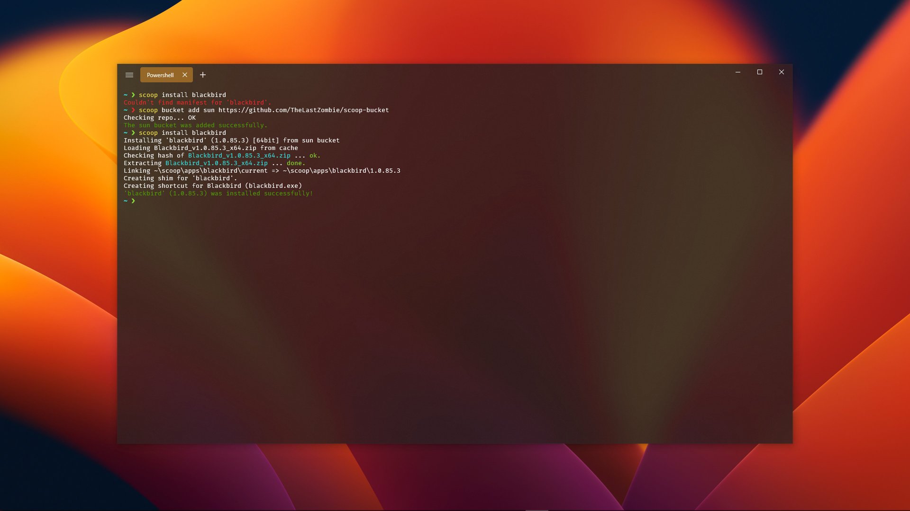

#  tlz's [Scoop](https://scoop.sh/) + [Shovel](https://shovel.ash258.com/) bucket [](https://github.com/TheLastZombie/scoop-bucket/actions/workflows/schedule.yml) 

Originally created so that I could finish my Windows 10 setup script, I now try to add any applications I come across that meet the [requirements](#requirements), just to make everyone's lives a little bit easier.

**Please be aware that due to Windows not being my main operating system anymore, this bucket will only get limited updates, fixes and additions from now on.**



[Installation](#installation) · [Uninstallation](#uninstallation) · [Applications](#applications) · [Disclaimer](#disclaimer) · [Requirements](#requirements) · [Contributing](#contributing)

## Installation

To add this bucket to your Scoop or Shovel installation, run one of the following commands:

```
scoop bucket add tlz https://github.com/TheLastZombie/scoop-bucket
shovel bucket add tlz https://github.com/TheLastZombie/scoop-bucket
```

**tlz** is the recommended title, though you can replace it with any name you'd like.

## Uninstallation

If you decide you no longer need this bucket, run one of the following commands to uninstall it:

```
scoop bucket rm tlz
shovel bucket rm tlz
```

This will not remove any applications installed from this bucket, though it will prevent you from getting any new updates for them.

If you chose a different title during the installation above, you'll have to replace **tlz** with the one you chose.

## Applications

To view a list of all included applications, head over to the [Scoop website](https://scoop.sh/#/apps?q=%22https%3A%2F%2Fgithub.com%2FTheLastZombie%2Fscoop-bucket%22&s=1&d=0&o=false), [Scoop directory](https://rasa.github.io/scoop-directory/by-bucket#TheLastZombie_scoop-bucket) or take a look inside the [bucket folder](https://github.com/TheLastZombie/scoop-bucket/tree/master/bucket).

## Disclaimer

Please note that some applications might not be portable, i. e. they may:

- create and use directories outside of their own (e. g. [ZOC Terminal](https://www.emtec.com/zoc/))
- create and modify registry keys and values (e. g. [sshpm](https://thelastzombie.github.io/sshpm/))
- access your system in other ways (e. g. [Xreveal](https://yubsoft.com/xreveal/))

It should also be noted that currently, some applications (e. g. [Bandcamp Downloader](https://github.com/Otiel/BandcampDownloader)) don't persist their files correctly.

## Requirements

For an application to be added, it needs to meet the following criteria:

- It must not be available via any other bucket listed on the [Scoop website](https://scoop.sh/#/apps?o=false) or in the [Scoop directory](https://rasa.github.io/scoop-directory/by-bucket).
- If written in Node.js or Python, it must not be available via [npm](https://www.npmjs.com/) or [pip](https://pip.pypa.io/).
- It must not require administrative or elevated privileges for the installation.
- It needs to provide a way to check for updates, so that it can be [auto-updated](https://github.com/marketplace/actions/bucket-minion).

Currently, the only exceptions to these rules are my own applications.

## Contributing

If you find anything that needs improvement (such as an application not working correctly if installed via this bucket), don't hesitate to [open an issue](https://github.com/TheLastZombie/scoop-bucket/issues/new)!

If you want to contribute application manifests, please consider the following alternatives first:

- If we're talking about one or two applications only, submit them to a fitting [well-known bucket](https://github.com/lukesampson/scoop/blob/master/buckets.json) instead.
- If we're talking about multiple applications, consider [creating your own bucket](https://github.com/lukesampson/scoop/wiki/Buckets#creating-your-own-bucket)! It's a lot of fun.
